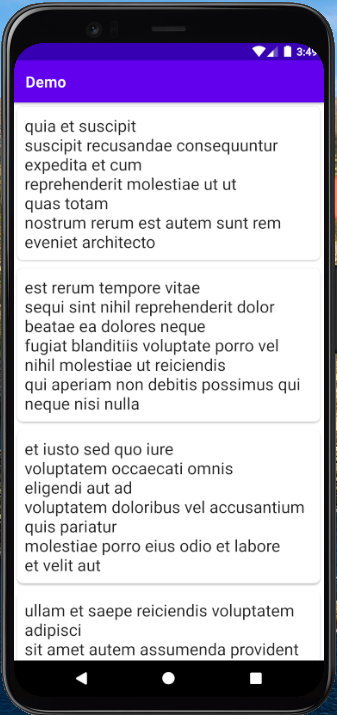
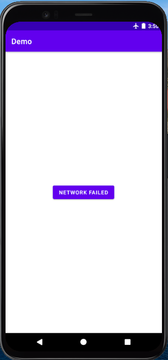

# MVVM + Daggger-Hilt + Retrofit + Sealed Class + State Flow + Coroutines

In this project , we will build a simple application ,where we fetch data from the server and show into recyclerview with the help of MVVM patter, Dagger-hilt , Retrofit, StateFlow , Sealed Class and Kotlin Coroutines. Hope you will enjoy and learn something new from this project :)

